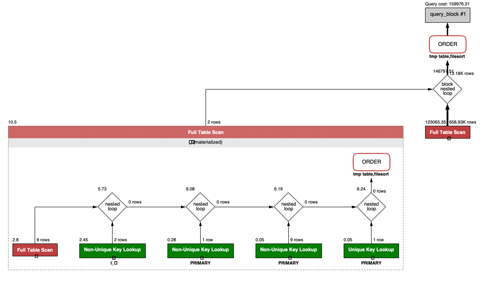
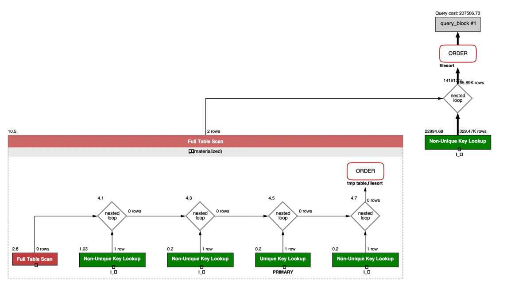
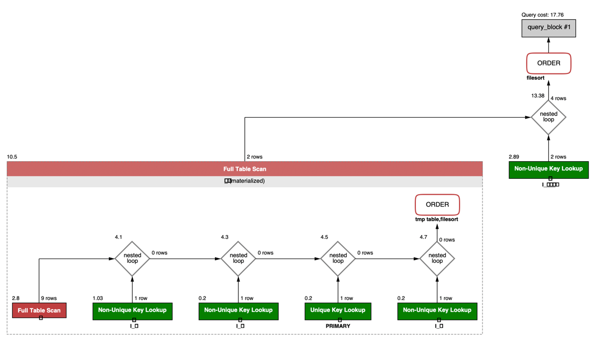
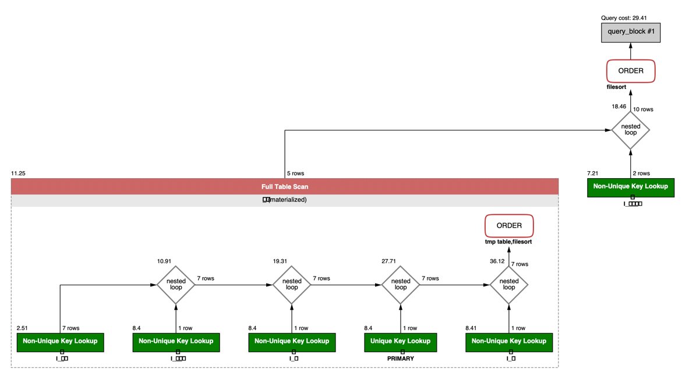

# A. 쿼리 연습

* [X] 활동중인(Active) 부서의 현재 부서관리자 중 연봉 상위 5위안에 드는 사람들이 최근에 각 지역별로 언제 퇴실했는지 조회해보세요.   
  (사원번호, 이름, 연봉, 직급명, 지역, 입출입구분, 입출입시간)
* [x] 쿼리 작성만으로 1s 이하로 반환한다.
* [x] 인덱스 설정을 추가하여 50 ms 이하로 반환한다.


## 쿼리 작성만으로 1s 이하로 반환하기
### 1차시도
실행시간 15.915s

실행시간이 상당히 오래 걸렸지만 결과가 나온것에 뿌듯했습니다.

```mysql
SELECT 부관.사원번호, 사.이름, 급.연봉, 직.직급명, 사출.지역, 사출.입출입구분, 사출.입출입시간 
FROM (SELECT 부서.부서번호 FROM 부서 WHERE 비고 = 'active') 
AS 부 
INNER JOIN (SELECT 사원번호, 부서번호 FROM 부서관리자 WHERE 종료일자 = '9999-01-01')  
AS 부관 ON 부.부서번호 = 부관.부서번호 
INNER JOIN (SELECT 사원번호, max(연봉) AS 연봉 FROM 급여 GROUP BY 사원번호)  
AS 급 ON 급.사원번호 = 부관.사원번호 
INNER JOIN (SELECT 사원번호, 입출입구분, 입출입시간, 지역 FROM 사원출입기록 WHERE 입출입구분 = 'O')  
AS 사출 ON 사출.사원번호 = 부관.사원번호 
INNER JOIN (SELECT 사원번호, 이름 FROM 사원)  
AS 사 ON 사.사원번호 = 부관.사원번호 
INNER JOIN (SELECT 사원번호, 직급명 FROM 직급 WHERE 직급명 = 'MANAGER')  
AS 직 ON 직.사원번호 = 부관.사원번호 
ORDER BY 급.연봉 DESC;
```


실행계획에서 급여 테이블에 full index scan 이 일어나는걸 확인할 수 있었습니다.

급여 테이블에서 많은 데이터의 row를 읽고 있으니 뭔가 해야겠다 생각했습니다.

급여 테이블에서 연봉 상위 5명의 부서 관리자 row만 읽어와야하는데 급여 테이블 하나만으로는 이것을 조회할 수 없으므로 부서관리자,부서 테이블을 함께 JOIN 하는 쿼리가 필요합니다.

급여 테이블, 부서관리자, 부서 테이블을 서브쿼리로 묶어서 5개의 row만 가져올 수 있으면 Join시 더욱 빠르지 않을까? 라고 생각했습니다.

full table scan이 일어나는 테이블이 있는데 이것은 뒤에서 언급하겠습니다.

### 2차 시도
실행시간 1.0s ~ 0.7s

사실 이게 맞을까 의문을 가지면서 진행했는데 실행시간이 줄어들어서 매우 뿌듯한 부분이었습니다.

조금 더 줄여보기 위해서 문제가 있는 부분을 찾아봤습니다.

서브 쿼리에서 FROM, INNER JOIN 마다 서브쿼리+WHERE 를 사용하고 있는데 이를 'WHERE를 한번에 처리할 수 있도록 하면 더 빠르지않을까?' 생각했습니다.

```mysql
SELECT 사.사원번호, 사.이름, 높은연봉_부서관리자.연봉, 직.직급명, 사출.지역, 사출.입출입구분, 사출.입출입시간
FROM (SELECT 사원번호, 입출입시간, 입출입구분, 지역 FROM 사원출입기록 WHERE 입출입구분 = 'O')
AS 사출
INNER JOIN (SELECT 급.사원번호, 급.연봉
            FROM (SELECT 사원번호, 연봉 FROM 급여 WHERE 종료일자 = '9999-01-01')
            AS 급
            INNER JOIN (SELECT 사원번호, 부서번호 FROM 부서관리자 WHERE 종료일자 = '9999-01-01')
            AS 부관 ON 급.사원번호 = 부관.사원번호
            INNER JOIN (SELECT 부서번호 FROM 부서 WHERE 비고 = 'active')
            AS 부 ON 부.부서번호 = 부관.부서번호
            ORDER BY 급.연봉 DESC
            LIMIT 0, 5)
AS 높은연봉_부서관리자 ON 높은연봉_부서관리자.사원번호 = 사출.사원번호
INNER JOIN 사원
AS 사 ON 사.사원번호 = 높은연봉_부서관리자.사원번호
INNER JOIN (SELECT 사원번호, 직급명 FROM 직급 WHERE 직급명 = 'MANAGER')
AS 직 ON 직.사원번호 = 높은연봉_부서관리자.사원번호
ORDER BY 높은연봉_부서관리자.연봉 DESC;
```


### 3차 시도
0.7 ~ 0.5

WHERE 절을 밖으로 빼서 한번에 처리하는게 더욱 빠르다 라는걸 느낄 수 있었습니다 :)

```mysql
SELECT 높은연봉_부서관리자.사원번호, 높은연봉_부서관리자.이름, 높은연봉_부서관리자.연봉, 높은연봉_부서관리자.직급명, 사출.지역, 사출.입출입구분, 사출.입출입시간
FROM (SELECT 급여.사원번호, 급여.연봉, 직급.직급명, 사원.이름
		FROM 급여
		INNER JOIN 부서관리자 ON 급여.사원번호 = 부서관리자.사원번호
		INNER JOIN 부서 ON 부서.부서번호 = 부서관리자.부서번호
		INNER JOIN 직급 ON 부서관리자.사원번호 = 직급.사원번호
		INNER JOIN 사원 ON 부서관리자.사원번호 = 사원.사원번호
		WHERE 부서.비고 = 'active' AND 부서관리자.종료일자 = '9999-01-01' 
				AND 급여.종료일자 = '9999-01-01' AND 직급.종료일자 = '9999-01-01'
		ORDER BY 급여.연봉 DESC
		LIMIT 0, 5)
AS 높은연봉_부서관리자
INNER JOIN (SELECT 사원번호, 입출입시간, 입출입구분, 지역 FROM 사원출입기록 WHERE 입출입구분 = 'O')
AS 사출 ON 사출.사원번호 = 높은연봉_부서관리자.사원번호
ORDER BY 높은연봉_부서관리자.연봉 DESC;
```




## 인덱스 설정을 추가하여 50 ms 이하로 반환한다.
### 1차 시도
위의 쿼리 튜닝 3차 시도의 쿼리를 이어서 사용합니다.

가장 먼저 full table scan 이 일어나는 사원출입기록 테이블을 손봐야합니다.   
상당히 많은 row를 가져오고 있기 때문에 사원출입기록 테이블에 인덱스를 추가해봅니다.   

```mysql
SELECT 사원번호, 입출입시간, 입출입구분, 지역 FROM 사원출입기록 WHERE 입출입구분 = 'O'
```

여기서 WHERE 절에서 사용하는 '입출입구분 컬럼'에 인덱스를 걸면 얼마나 차이가 있을까 시도해봤습니다.

```mysql
create index `I_입출입구분` ON tuning.사원출입기록 (입출입구분);
```

실행시간 0.8s ~ 0.4s

실행시간에 큰 차이는 없었지만 가져오는 row수는 확실히 줄었습니다.

```mysql
SELECT 높은연봉_부서관리자.사원번호, 높은연봉_부서관리자.이름, 높은연봉_부서관리자.연봉, 높은연봉_부서관리자.직급명, 사출.지역, 사출.입출입구분, 사출.입출입시간
FROM (SELECT 급여.사원번호, 급여.연봉, 직급.직급명, 사원.이름
		FROM 급여
		INNER JOIN 부서관리자 ON 급여.사원번호 = 부서관리자.사원번호
		INNER JOIN 부서 ON 부서.부서번호 = 부서관리자.부서번호
		INNER JOIN 직급 ON 부서관리자.사원번호 = 직급.사원번호
		INNER JOIN 사원 ON 부서관리자.사원번호 = 사원.사원번호
		WHERE 부서.비고 = 'active' AND 부서관리자.종료일자 = '9999-01-01' 
				AND 급여.종료일자 = '9999-01-01' AND 직급.종료일자 = '9999-01-01'
		ORDER BY 급여.연봉 DESC
		LIMIT 0, 5)
AS 높은연봉_부서관리자
INNER JOIN (SELECT 사원번호, 입출입시간, 입출입구분, 지역 FROM 사원출입기록 WHERE 입출입구분 = 'O')
AS 사출 ON 사출.사원번호 = 높은연봉_부서관리자.사원번호
ORDER BY 높은연봉_부서관리자.연봉 DESC;
```


정말 딱 절반정도 걸러진것 같습니다. 애초에 cardinality가 상당히 낮은 컬럼이기 때문에 큰 효과가 없었습니다.

### 2차 시도

조회 쿼리는 그대로 입니다.

사원출입기록의 입출입구분 컬럼에 인덱스를 걸어본것으로는 큰 재미를 못봤습니다.

그럼 다른 테이블의 부서관리자, 급여, 종료일자 WHERE절에서 종료일자가 사용되는게 보입니다.   
저곳에 인덱스를 걸어보면 상당수의 컬럼이 걸러질것으로 보입니다.. 람쥐!   
사실 이미 조회쿼리 만으로 많은 row를 걸러놔서 큰 효과가 없었습니다.

```mysql
create index `I_종료일자` ON tuning.부서관리자 (종료일자);
create index `I_종료일자` ON tuning.급여 (종료일자);
create index `I_종료일자` ON tuning.직급 (종료일자);
```

실행시간 0.6s ~ 0.4s

약간 빨라지긴 했지만 50ms는 아직 멀리있습니다.

어디를 건드려야 극적인 효과가 생길까 생각해봤습니다.




실행계획에서 Extra를 보면 사원 출입 기록에 Using index condition이 있습니다.
이게 뭔지 생소해서 찾아봤습니다.

[MySQL - 인덱스 컨디션 푸시다운. 이동욱 개발자님](https://jojoldu.tistory.com/474)

쉽게 설명해서 인덱스에 있는 필드지만 인덱스를 사용할 수 없는 범위조건일 때도 스토리지 엔진으로 범위 조건을 전달해주는 것입니다.
(MySQL 5.5버전 까지는 사용할 수 없는 범위조건은 전달 하지 않았습니다. 따라서 해당 조건은 MySQL 엔진에서 처리해야 했습니다.)

### 3차 시도
생각난것이 사원출입기록의 서브쿼리에서 몇가지 컬럼만 조회하도록 해놓은게 보였습니다.   
```mysql
INNER JOIN (SELECT 사원번호, 입출입시간, 입출입구분, 지역 FROM 사원출입기록 WHERE 입출입구분 = 'O')
```
Covered Index(커버링 인덱스)를 만들어보면 어떨까 생각했습니다.
[커버링 인덱스](https://gywn.net/2012/04/mysql-covering-index/)

```mysql
create index `I_입출입구분_사원번호_입출입시간_지역` ON tuning.사원출입기록 (입출입구분, 사원번호, 입출입시간, 지역);
```

실행시간 0.0062s ~ 0.0045s

상당히 많이 줄었습니다.

실행계획을 보면 사원출입기록이 Using index 로 바뀐것을 볼 수 있습니다.




### 4차 시도 (실험)

조금 뇌절해서 
* 다른 컬럼들도 서브쿼리로 만들고 
* 커버링 인덱스를 만들어주면 어떨까 생각했습니다.

```mysql
SELECT 높은연봉_부서관리자.사원번호, 높은연봉_부서관리자.이름, 높은연봉_부서관리자.연봉, 높은연봉_부서관리자.직급명, 사출.지역, 사출.입출입구분, 사출.입출입시간
FROM (SELECT 급여.사원번호, 급여.연봉, 직급.직급명, 사원.이름
		FROM (SELECT 사원번호, 연봉 FROM 급여 WHERE 종료일자 = '9999-01-01') AS 급여
		INNER JOIN (SELECT 사원번호, 부서번호 FROM 부서관리자 WHERE 종료일자 = '9999-01-01') AS 부서관리자 ON 급여.사원번호 = 부서관리자.사원번호
		INNER JOIN (SELECT 부서번호 FROM 부서 WHERE 비고 = 'active') AS 부서 ON 부서.부서번호 = 부서관리자.부서번호
		INNER JOIN 직급 ON 부서관리자.사원번호 = 직급.사원번호
		INNER JOIN 사원 ON 부서관리자.사원번호 = 사원.사원번호
        WHERE 직급.종료일자 = '9999-01-01'
		ORDER BY 급여.연봉 DESC
		LIMIT 0, 5)
AS 높은연봉_부서관리자
INNER JOIN (SELECT 사원번호, 입출입시간, 입출입구분, 지역 FROM 사원출입기록 WHERE 입출입구분 = 'O')
AS 사출 ON 사출.사원번호 = 높은연봉_부서관리자.사원번호
ORDER BY 높은연봉_부서관리자.연봉 DESC;
```
실행시간 0.0080s ~ 0.0045s

쿼리 코스트가 10.5 -> 11.25로 늘어난것을 볼 수 있습니다.

하지만 실행계획의 filtered는 상당히 깔끔해진것을 볼 수 있습니다.

여기서 궁금한 것이 있는데
* 쿼리 코스트가 떨어진 이유?
* 실행 속도가 평균적으로 떨어졌는데 이유가 무엇일까?




<div style="line-height:1em"><br style="clear:both" ></div>
<div style="line-height:1em"><br style="clear:both" ></div>